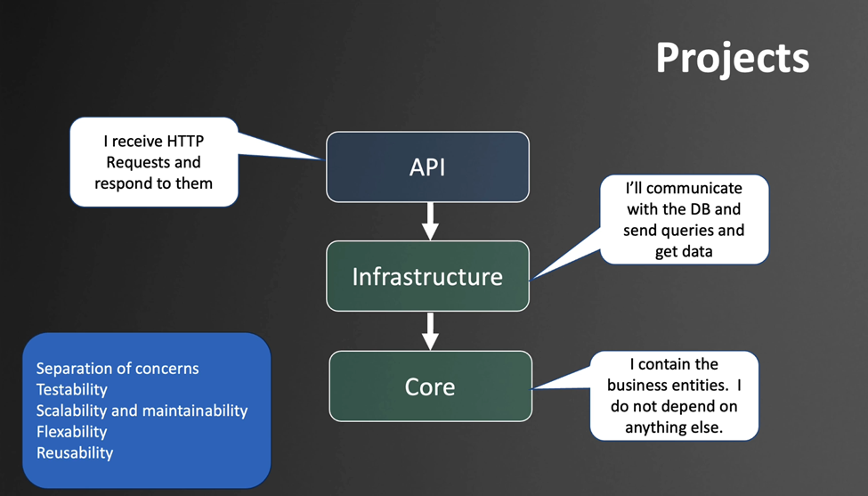

# Section 1: Creating the .NET Backend Project

This section outlines the steps to scaffold a .NET backend using the CLI, organize the solution structure, configure dependencies, and prepare for Entity Framework Core integration with SQL Server via Docker.

## 📁 Project Structure Overview
- Core: Contains domain entities and business logic.
- Infrastructure: Implements data access using Entity Framework Core.
- API: Exposes RESTful endpoints and handles HTTP requests.
Ensure EF Core version matches your .NET SDK version. Example: .NET 9.0.x → EF Core 9.0.x


## 🛠️ Project Setup with .NET CLI

Run the following commands to create and organize your solution and projects:

```bash
# List available project templates
dotnet new list

# Create a solution file
dotnet new sln

# Create a Web API project with controller support
dotnet new webapi -o API --use-controllers

# Create class library projects for domain and infrastructure layers
dotnet new classlib -o Core
dotnet new classlib -o Infrastructure

# Add projects to the solution
dotnet sln add API/
dotnet sln add Core/
dotnet sln add Infrastructure/

# List projects in the solution
dotnet sln list

```

## 🛠️ Project References
The API project depends on Infrastructure, which in turn depends on Core. Add the necessary references:
```bash
# Add references to class libraries
dotnet add API reference ../Infrastructure
dotnet add Infrastructure reference ../Core
```

## Required NuGet Packages
Install the following packages in respective projects:

Infrastructure:
```bash
Microsoft.EntityFrameworkCore.SqlServer
```
API:
```bash
Microsoft.EntityFrameworkCore.Design (used for migrations)
```

## Entity Framework Core Migrations
Install the EF CLI tool globally:
```bash
    dotnet tool install --global dotnet-ef --version 9.0.10
```
create and apply migrations:
```bash
# Create initial migration
dotnet ef migrations add InitialCreate -s API -p Infrastructure

# Apply migration to create the database
dotnet ef database update -s API -p Infrastructure

```

## API Architecture

### Repository pattern
decouble the business code from data access - separation of concerns
minimise duplicate query logic
testability

### specification pattern
if we have to much repositories, creating generic repository facilitate. But generic repository excludes the possibility of using specific repositories atributes, for example,
price, because not all repositories have that. we fix that by using the specification pattern.
- Describes a query in an object
- returns an IQueryable<T>
- Generic List method takes specification as a parameter
- Specification can have meaningful name

### Pagination
- Perfomance, only show some products to the user, only show more if they want to see it
- Parameters passed by query string pageNumber=2&pageSize=5


## Client
Angular application + Angular Materials + TailwindCSS
https://material.angular.dev/
https://tailwindcss.com/